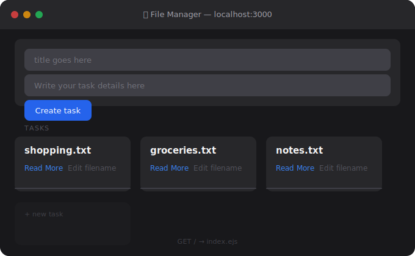
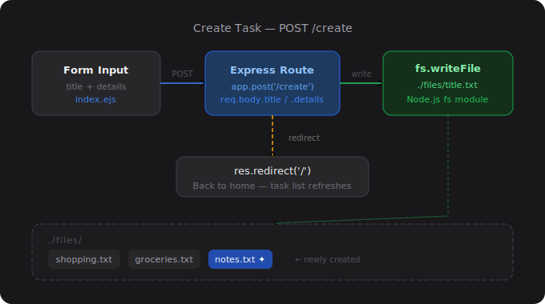
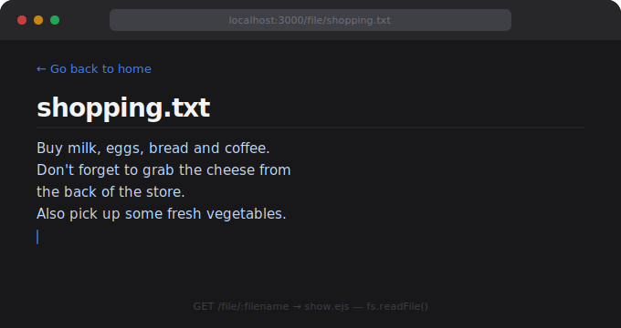
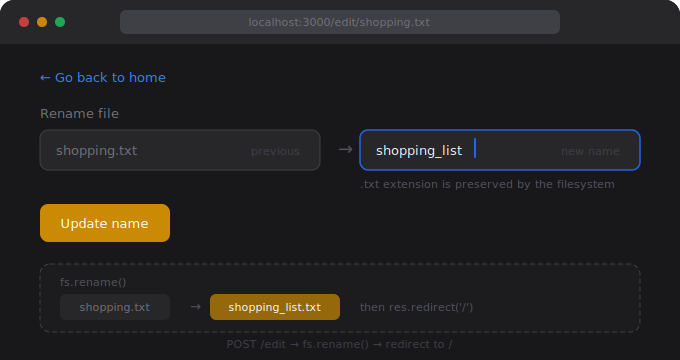
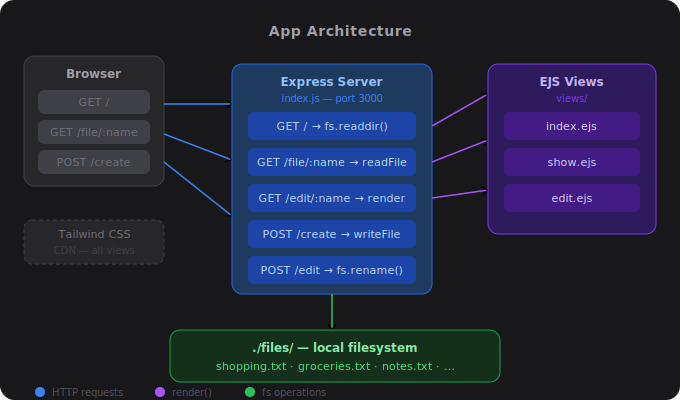

# 📝 File Manager App

A simple file management web app built with **Node.js**, **Express**, and **EJS**. Create, view, and rename text-based task files directly from the browser.

---

## 🖼️ Screenshots

### 🏠 Home Dashboard


### ➕ Create Task Flow


### 📄 View File Page


### ✏️ Edit / Rename File


### 🏗️ App Architecture


---

## 🚀 Features

- **Create tasks** – Add a title and details; saved as `.txt` files on the server
- **View tasks** – Read the full content of any file
- **Rename files** – Edit filenames through a dedicated edit page
- **Dynamic UI** – Rendered server-side using EJS templates with Tailwind CSS styling

---

## 🛠️ Tech Stack

| Layer      | Technology          |
|------------|---------------------|
| Runtime    | Node.js             |
| Framework  | Express.js v5       |
| Templating | EJS v5              |
| Styling    | Tailwind CSS (CDN)  |
| Storage    | Local filesystem    |

---

## 📁 Project Structure

```
├── files/              # Stores all created task .txt files
├── views/
│   ├── index.ejs       # Home page – lists all tasks + create form
│   ├── show.ejs        # View file content
│   └── edit.ejs        # Rename a file
├── svg-illustrations/  # README assets
├── index.js            # Main Express server
├── package.json
└── package-lock.json
```

---

## ⚙️ Getting Started

### Prerequisites
- [Node.js](https://nodejs.org/) installed

### Installation

```bash
# Clone the repository
git clone https://github.com/kautilyaFSD15/<repo-name>.git
cd <repo-name>

# Install dependencies
npm install

# Create the files directory if it doesn't exist
mkdir files
```

### Run the App

```bash
node index.js
```

Visit **http://localhost:3000** in your browser.

---

## 📖 API Routes

| Method | Route              | Description                    |
|--------|--------------------|--------------------------------|
| GET    | `/`                | Home page – lists all tasks    |
| GET    | `/file/:filename`  | View content of a specific file|
| GET    | `/edit/:filename`  | Edit/rename file page          |
| POST   | `/create`          | Create a new task file         |
| POST   | `/edit`            | Rename an existing file        |

---

## 👤 Author

**Kautilya Shukla**

---

## 📄 License

This project is licensed under the **ISC License**.
